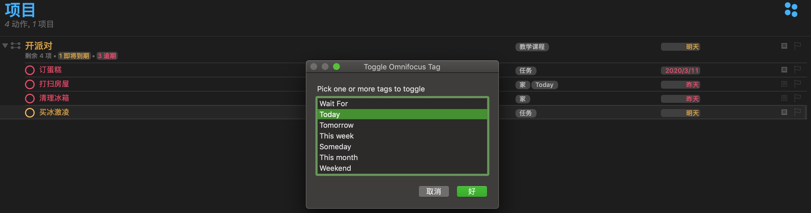
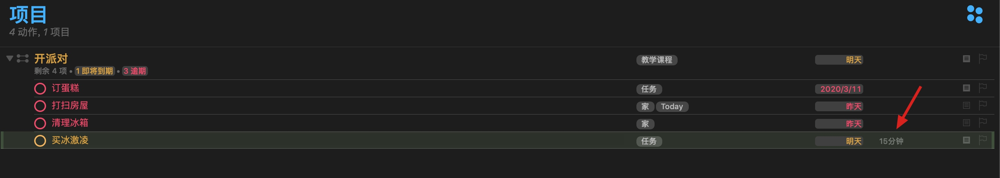
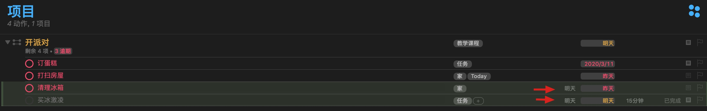
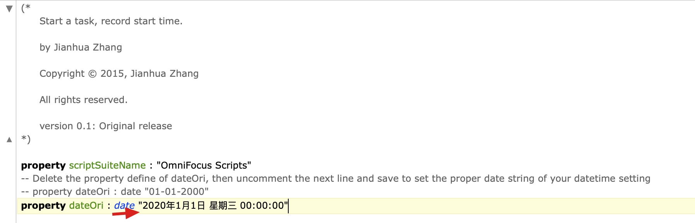
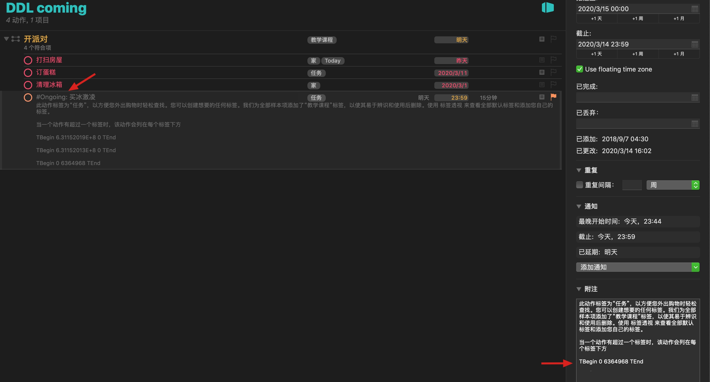
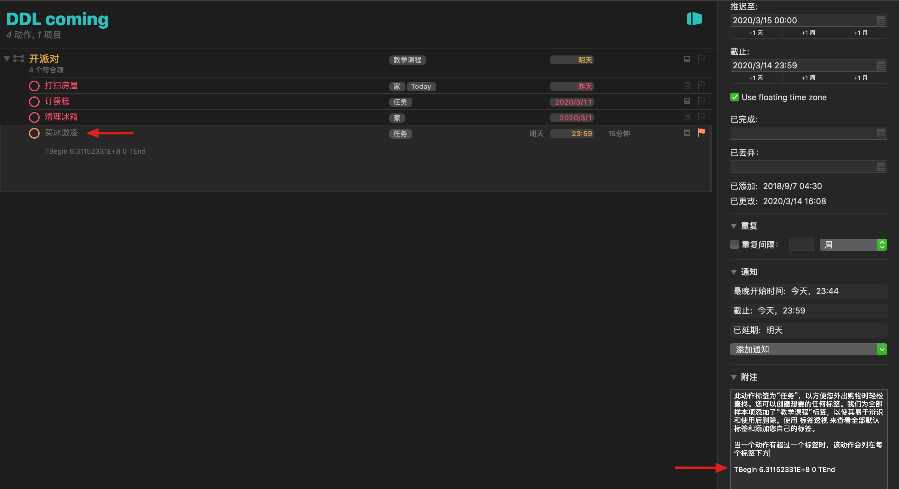
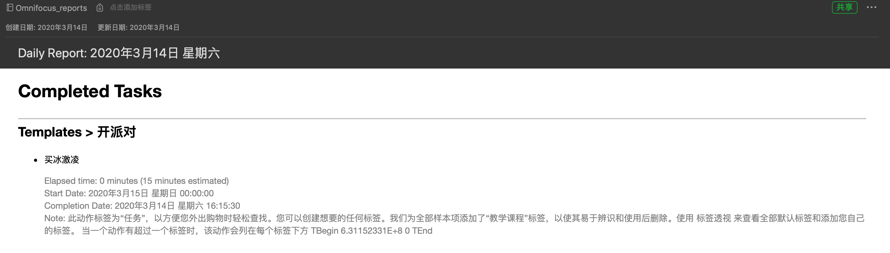

# omnifocus3-applescript
- some applescripts for omnifocus 3
- some content comes from Internet, pls test before use

## chooseFromTagList.scpt
choose one from several tags, and set for selected tasks:

## duration.scpt
Estimated Duration of Selected Tasks, unit is minute.

set duration to 15min:

## defer.scpt (depend on OmniFocusStrLib.scpt)
- please copy OmniFocusStrLib.scpt to '~/Library/Script Libraries/' directory

defre 1 day for selected tasks:

## update_defer_data_to_now.scpt
- if a task's defer date is before today, update it to today's date
- if a task is defter today, delete its defer date
- if a task is due after today and defer date after today, do nothing
- if a task has no due today, update it to today's date

after:

## how to get duration(end-start) of one task?
### strat.scpt
- tag selected task with '#Ongoing', and notify you 'action started'
- add 'TBegin 0 636... TEnd' to the end of notetext
- the number in 'TBegin 0 636... TEnd' should not be big number such as 10+E5.. If it's big number already, change oriDate to someday lately:

### stop.scpt
- remove selected task's tag '#Ongoing', and notify you 'action stopped'
- change 'TBegin 0 636... TEnd' to be 'TBegin 636... 0 TEnd'

### report.scpt

- based on the date info in notetext written by start.scpt and stop.scpt, report.scpt can generate a report file and send it to your evernote
- generated report will contain: ***completed*** task with task info, start date, complete date and duration
- report will create a folder named Omnifocus_reports in Evernote
- after excute report.scpt, there will be a dialog displayed like this:
  (item listed is report's time range)

the report sent to evernote is:

